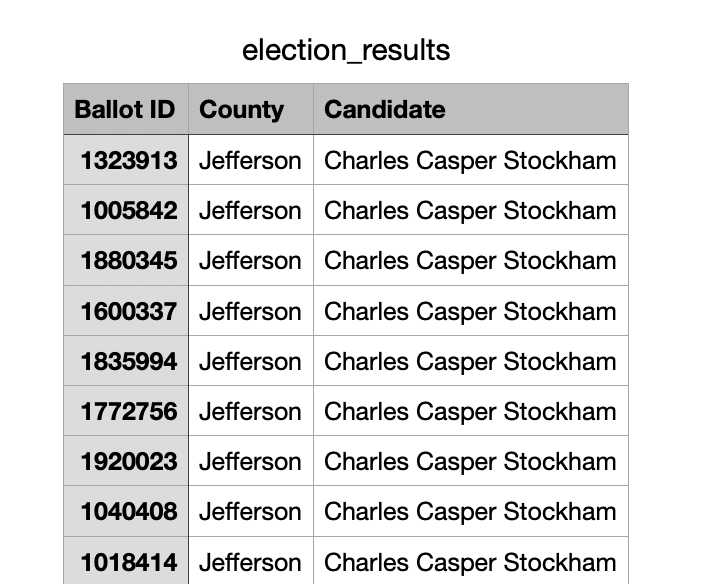

# Election_Analysis

## Project Overview

### A Colorado Board of Elections employee has given the following tasks to complete the election audit of a recent local congressional election:

1. Calculate the total number of votes cast. 
2. Get a complete list of candidates who receieved votes. 
3. Calculate the total number of votes each candidate received. 
4. Calculate the percentage of votes each candidate won. 
5. Determine the winner of the election based on popular vote. 

## Resources
- Data Source: election_results.csv
- Software: Python 3.6.1; Visual Studio Code, 1.38.1 

## Summary 
### The analysis of the election shows that: 
- There were 369,711 votes cast in the election. 
- The candidates were: 
  1. Charles Casper Stockham
  2. Diana DeGette
  3. Raymon Anthony Doane
- The candidate results were: 
  1. Charles Casper Stockham received 23.0% of the vote and 85,213 votes. 
  2. Diana DeGette received 73.8% of the vote and 272,892 votes.
  3. Raymon Anthony Doane received 3.1% of the vote and 11,606 votes.
- The winner of the election was: 
  - Diana DeGette, who received 73.8% of the vote and 272,892 votes. 
  
## Challenge Overview
### The following tasks were requested to be added to the election analysis audit: 

1. Calculate the voter turnout for each county.
2. Calculate the percentage of votes from each county out of the total vote count. 
3. Determine the county with the highest voter turnout. 

## Challenge Summary
### The analysis of the election shows that: 
- There were 369,711 votes cast in the election. 
- The counties in the election were: 
  1. Jefferson County
  2. Denver County
  3. Arapahoe County 
- The county results were: 
  1. 38,855 votes came from Jefferson County, representing 10.5% of the total vote count. 
  2. 306,055 votes came from Denver County, representing 82.8% of the total vote count. 
  3. 24,801 votes came from Arapahoe County, representing 6.7% of the total vote count. 
- The county with the highest voter turnout was Denver County, which had 306,055 votes, representing 82.8% of the total vote count. 

### Election-Audit Summary
The script used in the PypollChallenge.py file (included in this repository) analyzed the election data loaded from the election_results.csv file (also included in this repository). A snapshot of the data structure from the election_results.csv file is included below:

 
 
The same script in the PyPollChallenge.py file was essentially used twice in this election audit: once to tally from the csv file the total votes for each candidate in the election, and then again with minor modifications to tally the total votes for each county in the election. As may be deduced from the image above, the only modification necessary to the script to perform the second task was to reference columns 1 and 2 of the data ("Ballot ID" and "County"), rather than columns 1 and 3 ("Ballot ID" and "Candidate"). This was done by:

- Modifying the first existing "for loop" in the script (in order to count the total votes for each county, in addition to the total votes for each candidate); and 
- Adding an additional "for loop" to determine the county with the highest voter turnout in the election. 

In a similar fashion, this script could be modified for use in a national election, where election data may be provided at both the county and state level. In that case: 

- The first existing "for loop" could be modified to count the total votes for each state (in addition to the total votes for each county and candidate); and 
- An additional "for loop" could be added to determine the state with the highest voter turnout. 

Additionally, the script could be modified to determine the candidate with the most votes from each county in an election, essentially by referencing columns 2 and 3 ("County" and "Candidate") of the data from the image above. This would be accomplished by: 
- Modifiying the first existing "for loop" by nesting the existing dictionary which tracks vote counts for each candidate within a dictionary of counties. So essentially, the the snytax of the nested dictionary would appear as: 
`{"county":{"candidate":"vote count"}}` 
- Adding an additional "for loop" to determine the most voted-for candidate in each county. 
